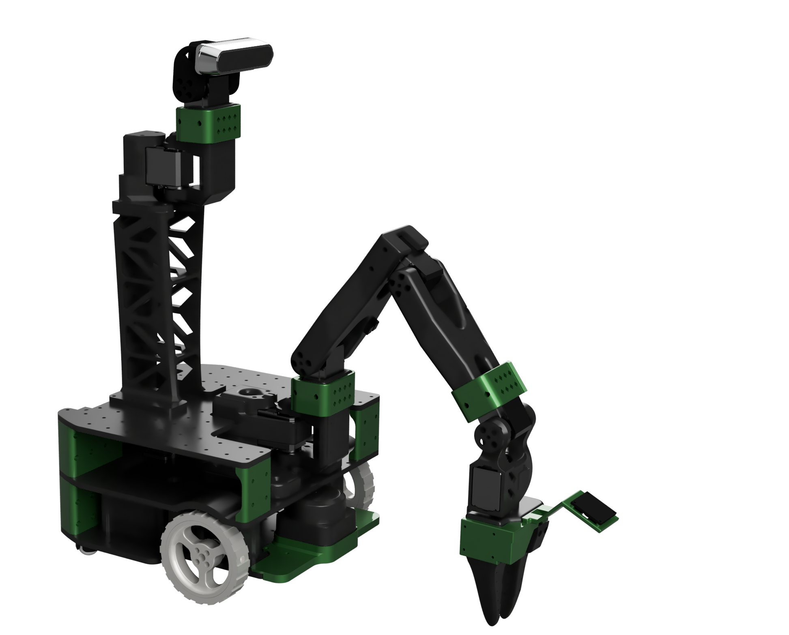
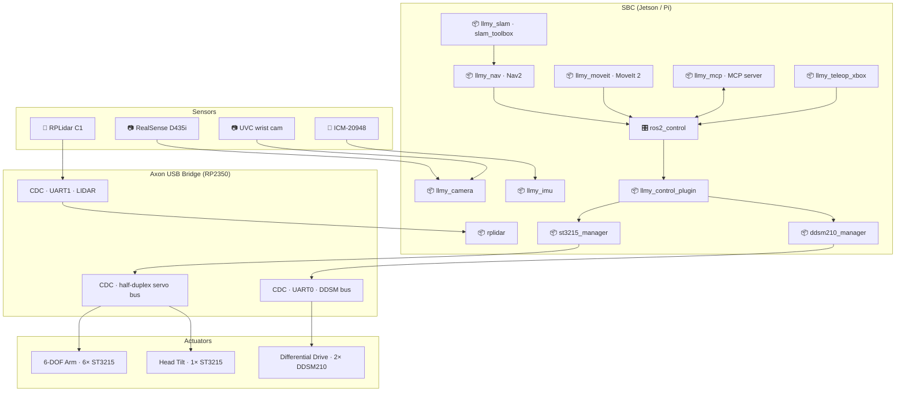

# LLMy (leh·mee)

<p>
  <a href="https://opensource.org/licenses/MIT">
    
  </a>
  <a href="https://docs.ros.org/en/jazzy/">
    
  </a>
  <a href="http://gazebosim.org/">
    
  </a>
</p>

<p align="center">
  
</p>


**LLMy** is a fully 3D-printed mobile manipulator built to be affordable, modular and ready to experiment with. 

| Component | Description |
|-----------|-------------|
| **Power** | 145W USB-C power bank with dual USB-PD triggers (12V) |
| **Compute** | Almost any SBC or Mini-PC under 75W |
| **Arm + Head** | 7× FEETECH ST3215 bus servos (6-DOF arm + 1-axis tilt) |
| **Drive** | 2× Waveshare DDSM210 direct-drive hub motors (differential) |
| **Bus Bridge** | [Axon](https://github.com/cristidragomir97/axon) — custom RP2350 PCB exposing the half-duplex servo bus, DDSM UART, RS485, CAN, and I²C over USB-CDC |
| **Perception** | RGB-D head camera and UVC wrist camera |
| **Localization** | RPLidar C1 (2D SLAM), wheel encoders, ICM-20948 IMU |

> 📋 **[Full BOM with sourcing links](docs/bom.md)** — includes camera options, SBC recommendations, and alternatives.


## 🏗️ Architecture

LLMy follows a modular ROS2 architecture that separates concerns between simulation, hardware interfaces, control, and user interaction. 

- **Hardware Abstraction**: The `ros2_control` framework provides a clean interface between high-level controllers (MoveIt2, Nav2) and low-level hardware, allowing the same code to run in both simulation and on real hardware.

- **Modular Sensors**: Each sensor system (cameras, IMU, LIDAR) is encapsulated in its own ROS2 package, publishing standardized messages that any application can consume. This makes it easy to swap sensors or add new ones without modifying application code.

- **Layered Control**: The control stack is separated into layers - from the motor manager nodes handling individual bus transactions, through the ros2_control plugin managing the hardware interface, up to high-level motion planning with MoveIt2 and navigation with Nav2.

- **Unified USB Bridge**: A single custom PCB ([Axon](https://github.com/cristidragomir97/axon)) consolidates every bus on the robot (half-duplex servo bus, DDSM UART, LIDAR UART, RS485, CAN, I²C) into one USB composite device. The SBC sees stable `/dev/axon-*` symlinks (via bundled udev rules) and each bus stays independent.

- **Simulation-First Development**: Gazebo integration allows safe development and testing before deploying to hardware. The same launch files and controllers work in both environments, reducing the simulation-to-reality gap.




--- 

### 📦 ROS Packages

**Core Packages:**
- [**llmy_description**](ros/src/llmy_description/) - Robot URDF model with accurate kinematics and collision meshes
- [**llmy_control_plugin**](ros/src/llmy_control_plugin/) - ros2_control SystemInterface that bridges controllers to the motor-manager nodes over ROS topics
- [**llmy_control**](ros/src/llmy_control/) - Controller parameters, ros2_control configurations, hw/sim launch files
- [**st3215_manager**](ros/src/st3215_manager/) - Driver for FEETECH ST3215 servo groups (arm + head)
- [**ddsm210_manager**](ros/src/ddsm210_manager/) - Driver for Waveshare DDSM210 direct-drive wheel motors
- [**llmy_teleop_xbox**](ros/src/llmy_teleop_xbox/) - Xbox controller interface for manual driving + arm
- [**llmy_bringup**](ros/src/llmy_bringup/) - Top-level hardware bringup launch

**Navigation & SLAM:**
- [**llmy_nav**](ros/src/llmy_nav/) - Nav2 configuration and navigation mode management (mapping, navigation, mapfree, slam_nav)
- [**llmy_slam**](ros/src/llmy_slam/) - slam_toolbox configs for mapping and online SLAM

**Manipulation:**
- [**llmy_moveit**](ros/src/llmy_moveit/) - MoveIt 2 configuration for the 6-DOF arm (OMPL planning, KDL kinematics)

**Sensor & Vision:**
- [**llmy_camera**](ros/src/llmy_camera/) - RGB-D camera integration with depth-to-laser conversion
- [**llmy_imu**](ros/src/llmy_imu/) - IMU sensor fusion for orientation and navigation

**AI & Integration:**
- [**llmy_mcp**](ros/src/llmy_mcp/) - MCP (Model Context Protocol) server exposing ROS2 interfaces to LLMs

**Simulation:**
- [**llmy_gazebo**](ros/src/llmy_gazebo/) - Configurations and launch files for Gazebo simulation


**📋 [Detailed Package Documentation](docs/packages.md)**


## 🚀 Quick Start

### 🎮 Simulation (Fastest Way to Try LLMy!)

Get the robot running in Gazebo simulation in just a few commands:

```bash
# Clone and build the workspace
git clone https://github.com/cristidragomir97/llmy llmy_ws
cd llmy_ws/ros
vcs import src < repos.vcs
rosdep install --from-paths src --ignore-src -r -y
colcon build --symlink-install
source install/setup.bash

# Launch Gazebo simulation with controllers
ros2 launch llmy_gazebo gazebo.launch.py
```

The robot will spawn in Gazebo with all controllers active.

In a new terminal, start Xbox controller teleoperation:

```bash
ros2 launch llmy_teleop_xbox teleop_xbox.launch.py
```

**🎮 Xbox Controller Mapping:**
- **🏎️ Base Movement:** Right stick (forward/back + rotate)
- **🦾 Arm Control:**
  - **Joint 1:** RB (+) / LB (−)
  - **Joint 2:** RT (+) / LT (−)
  - **Joint 3:** Y (+) / A (−)
  - **Joint 4:** B (+) / X (−)
  - **Joint 5:** Start (+) / Back (−)
  - **Joint 6:** Right-stick click (+) / Left-stick click (−)
- **📷 Camera Tilt:** D-pad up/down

### 🏭 Hardware (via Forge)

LLMy on the real robot is deployed via [**Forge**](https://github.com/cristidragomir97/robocore-forge) — a lightweight deployment tool that takes a declarative `robot.yaml`, builds one Docker image per ROS component, and wires them together with a generated `docker-compose.<host>.yaml`. Each package (motion, SLAM, nav, camera, IMU, LIDAR, MCP, teleop, etc.) runs in its own container and communicates over a shared [Zenoh](https://zenoh.io/) router, so any single component can be rebuilt, restarted, or swapped without touching the rest.

The flow:

1. Edit `robot.yaml` — declare components, the packages each includes, the hardware devices each needs mounted, and the host it runs on.
2. `forge build` — one image per component, ready to push.
3. `forge deploy` — copies the generated compose file to the target and runs `docker compose up -d`.

Everything under `ros/src/` is plain ROS 2; Forge is just the packaging layer. You can bypass it entirely and run `colcon build` + `ros2 launch` on the SBC if you prefer bare metal.

### 📐 First-time calibration

Before commanding the arm, the servo encoder zeros need to match the URDF's zero pose. Walk through:

**📖 [Arm calibration guide](docs/arm-calibration.md)**

For general setup and troubleshooting:

**📖 [Getting Started Guide](docs/getting-started.md)**

---

--- 
## 🙏 Credits & Acknowledgments
This project stands on the shoulders of incredible open-source work:

- **[LeRobot Team](https://github.com/huggingface/lerobot)** - For pioneering accessible robotics and AI integration
- **[SIGRobotics-UIUC](https://github.com/SIGRobotics-UIUC)** - For their foundational work on LeKiwi
- **[Pavan Vishwanath](https://github.com/Pavankv92)** - ROS2 package development for [LeRobot SO-ARM101](https://github.com/Pavankv92/lerobot_ws)
- **[Gaotian Wang](https://github.com/Vector-Wangel/XLeRobot)** - For his amazing work on XLeRobot. Also for being kind enough to publish the STEP files for his robot upon request, files that were used to create the camera tower for LLMy. 

---
<div align="center">

<strong>⭐ Star this repo if LLMy helped you build something awesome! ⭐</strong>
</div>
