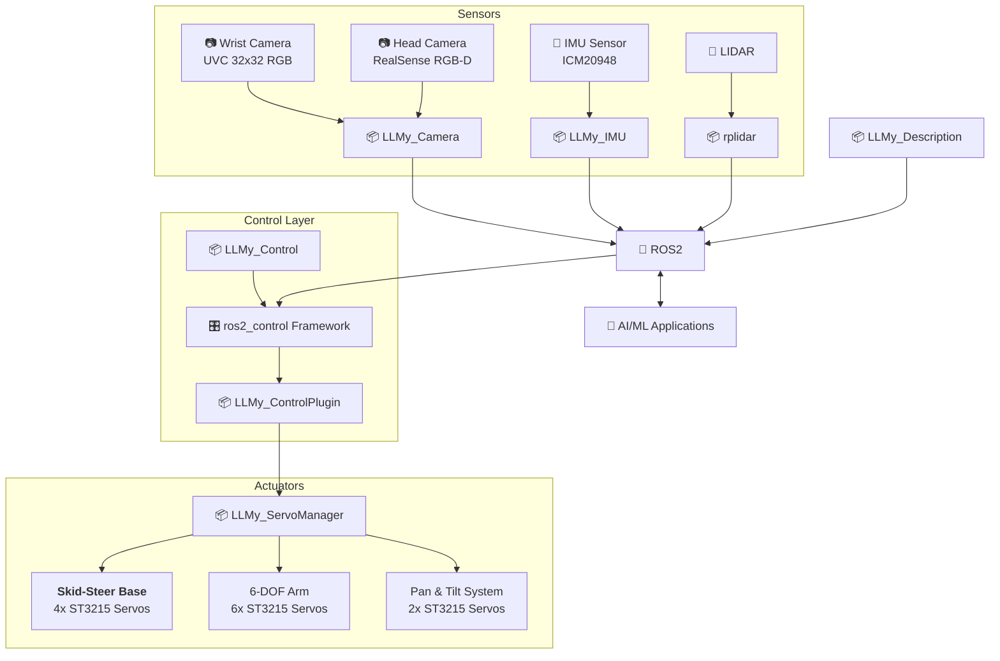

# LLMy (leh·mee)

<p>
  <a href="https://opensource.org/licenses/MIT">
    
  </a>
  <a href="https://docs.ros.org/en/jazzy/">
    
  </a>
  <a href="http://gazebosim.org/">
    
  </a>
</p>

<p align="center">
  
</p>


**LLMy** is a fully 3D-printed mobile manipulator built as a hands-on playground for **Hybrid Robotics**.

Hybrid Robotics is an architectural approach that combines the **reliability of deterministic control systems** with the **flexibility and reasoning capabilities of Large Language Models (LLMs)**. Rather than replacing classical robotics stacks, LLMy layers intelligence *on top* of them.

At its core, LLMy’s “brain” is organized into **three cooperative layers**, each with a clearly defined responsibility.


## 🧱 Layer 0 – Hardware

The hardware layer provides the physical capabilities that make everything else possible.  
LLMy is designed to be **affordable, modular, and easy to assemble**, using off-the-shelf components wherever possible.

- **Power system**  
  145 W USB-C power bank with dual USB-PD triggers, supplying clean 12 V power to all subsystems

- **Compute**  
  Raspberry Pi 5 or Jetson Orin Nano as the main SBC, running ROS 2 and handling perception and control

- **Actuators**  
  10× STS3215 serial bus servos in a daisy-chain configuration via a Waveshare ESP32 controller

- **Perception**  
  RGB-D head camera, wrist camera for manipulation, and an ICM-20948 IMU for orientation

- **Localization**  
  RPLidar C1 and ICM-20948 providing data for 2D SLAM and environment mapping

---

## ⚙️ Layer 1 – The Body and Reflexes

This layer is responsible for **precision, safety, and real-time execution**.  
It is built entirely on well-established ROS 2 tooling and is designed to behave predictably under all conditions.

- **Hardware abstraction**  
  `ros2_control` manages low-level motor and sensor interfaces, cleanly abstracting hardware details

- **Mapping & localization**  
  `slam_toolbox` provides robust 2D SLAM for environment mapping and localization

- **Navigation**  
  Nav2 handles path planning, obstacle avoidance, and autonomous movement from A to B

- **Manipulation**  
  MoveIt 2 plans collision-free trajectories and solves inverse kinematics for the robotic arm

- **Communication backbone**  
  ROS 2 enables scalable, high-performance data exchange across the system.

---

## 🧠 Layer 2 – The Mind

The probabilistic layer introduces **reasoning, flexibility, and high-level planning**.
Instead of hard-coding behaviors, LLMy exposes its deterministic capabilities—navigation, manipulation, perception—as **MCP Tools**. 

A language model, local or in the cloud, reasons about *what* should be done, while the underlying ROS stack guarantees *how* it is executed.

#### Natural-language goals
  Accepts high-level, human-readable instructions such as: ```Clean up the spill in the kitchen```

### Task decomposition
  Transforms goals into structured, executable steps, for example:
    * navigate to the kitchen
    * locate the spill
    * select and execute a manipulation primitive
    * verify task completion

### Service orchestration
Each step is executed by invoking ROS 2 services via the Model Context Protocol (MCP), ensuring:
  
  - a clear separation between reasoning and control
  - deterministic and safe execution
  - introspectable and debuggable system behavior

---

## 🚀 Quick Start

### 🎮 Simulation (Fastest Way to Try LLMy!)

Get the robot running in Gazebo simulation in just a few commands:

```bash
# Clone and build the workspace
git clone github.com/cristidragomir97/llmy llmy_ws
cd llmy_ws/ros
colcon build
source install/setup.bash

# Launch Gazebo simulation with controllers
ros2 launch llmy_gazebo sim.launch.py
```

The robot will spawn in Gazebo with all controllers active. 

In a new terminal - start Xbox controller teleoperation

```bash
ros2 launch llmy_teleop_xbox teleop_xbox.launch.py
```
**🎮 Xbox Controller Mapping:**
- **🏎️ Base Movement:** Right stick (forward/back + rotate)
- **🦾 Arm Control:**
  - **Joint 1:** RB button (+) / LB button (-)
  - **Joint 2:** RT trigger (+) / LT trigger (-)
  - **Joint 3:** Y button (+) / A button (-)
  - **Joint 4:** B button (+) / X button (-)
  - **Joint 5:** Start button (+) / Back button (-)
  - **Joint 6:** Right stick click (+) / Left stick click (-)
- **📷 Camera Control:**
  - **Pan:** D-pad up/down
  - **Tilt:** D-pad left/right

For detailed setup instructions, hardware configuration, and troubleshooting, see:

**📖 [Getting Started Guide](docs/getting-started.md)** - Complete installation and setup instructions for both simulation and hardware

---

## 🏗️ Architecture

LLMy follows a modular ROS2 architecture that separates concerns between simulation, hardware interfaces, control, and user interaction. 

- **Hardware Abstraction**: The `ros2_control` framework provides a clean interface between high-level controllers (MoveIt2, Nav2) and low-level hardware, allowing the same code to run in both simulation and on real hardware.

- **Modular Sensors**: Each sensor system (cameras, IMU, LIDAR) is encapsulated in its own ROS2 package, publishing standardized messages that any application can consume. This makes it easy to swap sensors or add new ones without modifying application code.

- **Layered Control**: The control stack is separated into layers - from the servo manager handling individual motor commands, through the ros2_control plugin managing the hardware interface, up to high-level motion planning with MoveIt2 and navigation with Nav2.

- **Simulation-First Development**: Gazebo integration allows safe development and testing before deploying to hardware. The same launch files and controllers work in both environments, reducing the simulation-to-reality gap.




--- 

### 📦 ROS Packages

**Core Packages:**
- [**llmy_description**](ros/src/llmy_description/) - Robot URDF model with accurate kinematics and collision meshes
- [**llmy_control_plugin**](ros/src/llmy_control_plugin) - ros2_control hardware bridge enabling MoveIt2/Nav2 integration
- [**llmy_control**]() - Controller parameters and ros2_control configurations
- [**llmy_servo_manager**]() - Low-level motor control with real-time telemetry
- [**llmy_teleop_xbox**]() - Xbox controller interface for manual operation

**Sensor & Vision:**
- [**llmy_camera**]() - RGB-D camera integration with depth-to-laser conversion
- [**llmy_imu**]() - IMU sensor fusion for orientation and navigation

**Simulation Packages**
- **llmy_gazebo** - Configurations and launch files for the Gazebo Classic


**📋 [Detailed Package Documentation](docs/packages.md)**


--- 
## 🙏 Credits & Acknowledgments
This project stands on the shoulders of incredible open-source work:

- **[LeRobot Team](https://github.com/huggingface/lerobot)** - For pioneering accessible robotics and AI integration
- **[SIGRobotics-UIUC](https://github.com/SIGRobotics-UIUC)** - For their foundational work on LeKiwi
- **[Pavan Vishwanath](https://github.com/Pavankv92)** - ROS2 package development for [LeRobot SO-ARM101](https://github.com/Pavankv92/lerobot_ws)
- **[Mateus Menezes](https://github.com/mateusmenezes95)** - [Omnidirectional controllers](https://github.com/mateusmenezes95/omnidirectional_controllers) and [AxeBot](https://github.com/mateusmenezes95/axebot) simulation expertise
- **[Gaotian Wang](https://github.com/Vector-Wangel/XLeRobot)** - For his amazing work on XLeRobot. Also for being kind enough to publish the STEP files for his robot upon request, files that were used to create the camera tower for LLMy. 

---
<div align="center">

<strong>⭐ Star this repo if LLMy helped you build something awesome! ⭐</strong>
</div>
