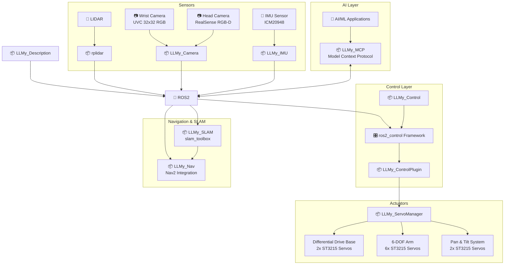

# LLMy (leh·mee)

<p>
  <a href="https://opensource.org/licenses/MIT">
    
  </a>
  <a href="https://docs.ros.org/en/jazzy/">
    
  </a>
  <a href="http://gazebosim.org/">
    
  </a>
</p>

<p align="center">
  
</p>


**LLMy** is a fully 3D-printed mobile manipulator built as a hands-on playground for the integration of **reliable deterministic control** with the **reasoning capabilities of LLMs**. 


## 🧱 Layer 0 – Hardware

The physical foundation.  Affordable (about 300$ for the basic platform), modular, and easy to assemble.

| Component | Description |
|-----------|-------------|
| **Power** | 145W USB-C power bank with dual USB-PD triggers (12V) |
| **Compute** | Almost any SBC or Mini-PC under 12x12cm |
| **Actuators** | 10× STS3215 servos via Waveshare ESP32 controller |
| **Perception** | RGB-D head camera and wrist camera  |
| **Localization** | RPLidar C1 for 2D SLAM, Wheel Encoders, ICM-20948 IMU |

> 📋 **[Full BOM with sourcing links](docs/bom.md)** — includes camera options, SBC recommendations, and alternatives.


## ⚙️ Layer 1 – The Body and Reflexes

This layer is responsible for **precision, safety, and real-time execution**.  
It is built entirely on well-established ROS 2 tooling and is designed to behave predictably under all conditions.

- **Hardware abstraction** — [ros2_control]() manages low-level motor and sensor interfaces, cleanly abstracting hardware details

- **Mapping & localization** — [slam_toolbox](https://github.com/SteveMacenski/slam_toolbox/tree/ros2) provides robust 2D SLAM for environment mapping and localization

- **Navigation** — [Nav2](https://docs.nav2.org/) handles path planning, obstacle avoidance, and autonomous movement from A to B

- **Manipulation** — [MoveIt](https://moveit.picknik.ai/main/index.html) plans collision-free trajectories and solves inverse kinematics for the robotic arm


---


## 🧠 Layer 2 – The Mind

LLMy exposes its deterministic capabilities as **MCP Tools**, letting an LLM reason about *what* to do while the ROS stack handles *how*.


### Example 1
*My cats love digging in my plant pot and throwing dirt around during the night. So I added a laser pointer to the robot.*

```
"Check on the big plant pot. If you find cats inside use the laser pointer"
```

The LLM decomposes this into executable steps, each invoking ROS 2 services via MCP:

1. **Search for plant** → Roams using Nav2, continuously capturing frames and querying VLM: "Do you see a large plant pot?"
2. **Approach & inspect** → Once found, navigates closer and asks VLM: "Is there dirt scattered around the pot?"
3. **Assess situation** → VLM returns detection + bounding boxes, projected to map coordinates
4. **Report or act** → Enable the the GPIO pin for the laser pointer to distract them


### Example 2
*I'm away from home, and I would like to SSH into my computer, but it's turned off*

```
"Turn on my PC"
```

1. **Locate workstation** → Roams and queries VLM: "Do you see a desktop PC or workstation?"
2. **Find power button** → Moves closer, asks VLM: "Where is the power button?" — gets pixel coordinates
3. **Position for reach** → Projects button location to 3D, plans base position for arm reach
4. **Press button** → MoveIt plans trajectory, arm extends and presses the button

Two very different tasks — inspection vs. manipulation — handled by the same robot without writing a single line of code. The LLM simply chains MCP tools in a different order based on the request.

---


## 🏗️ Architecture

LLMy follows a modular ROS2 architecture that separates concerns between simulation, hardware interfaces, control, and user interaction. 

- **Hardware Abstraction**: The `ros2_control` framework provides a clean interface between high-level controllers (MoveIt2, Nav2) and low-level hardware, allowing the same code to run in both simulation and on real hardware.

- **Modular Sensors**: Each sensor system (cameras, IMU, LIDAR) is encapsulated in its own ROS2 package, publishing standardized messages that any application can consume. This makes it easy to swap sensors or add new ones without modifying application code.

- **Layered Control**: The control stack is separated into layers - from the servo manager handling individual motor commands, through the ros2_control plugin managing the hardware interface, up to high-level motion planning with MoveIt2 and navigation with Nav2.

- **Simulation-First Development**: Gazebo integration allows safe development and testing before deploying to hardware. The same launch files and controllers work in both environments, reducing the simulation-to-reality gap.




--- 

### 📦 ROS Packages

**Core Packages:**
- [**llmy_description**](ros/src/llmy_description/) - Robot URDF model with accurate kinematics and collision meshes
- [**llmy_control_plugin**](ros/src/llmy_control_plugin/) - ros2_control hardware bridge enabling MoveIt2/Nav2 integration
- [**llmy_control**](ros/src/llmy_control/) - Controller parameters and ros2_control configurations
- [**llmy_servo_manager**](ros/src/llmy_servo_manager/) - Low-level motor control with real-time telemetry
- [**llmy_teleop_xbox**](ros/src/llmy_teleop_xbox/) - Xbox controller interface for manual operation
- [**llmy_bringup**](ros/src/llmy_bringup/) - Hardware bringup launching camera, IMU, micro-ROS agent, and ros2_control

**Navigation & SLAM:**
- [**llmy_nav**](ros/src/llmy_nav/) - Nav2 configuration and navigation mode management
- [**llmy_slam**](ros/src/llmy_slam/) - SLAM integration using slam_toolbox with custom launch files

**Sensor & Vision:**
- [**llmy_camera**](ros/src/llmy_camera/) - RGB-D camera integration with depth-to-laser conversion
- [**llmy_imu**](ros/src/llmy_imu/) - IMU sensor fusion for orientation and navigation

**AI & Integration:**
- [**llmy_mcp**](ros/src/llmy_mcp/) - MCP (Model Context Protocol) server exposing ROS2 interfaces to LLMs

**Simulation & Visualization:**
- [**llmy_gazebo**](ros/src/llmy_gazebo/) - Configurations and launch files for Gazebo simulation
- [**llmy_rviz**](ros/src/llmy_rviz/) - RViz configuration and visualization presets


**📋 [Detailed Package Documentation](docs/packages.md)**


## 🚀 Quick Start

### 🎮 Simulation (Fastest Way to Try LLMy!)

Get the robot running in Gazebo simulation in just a few commands:

```bash
# Clone and build the workspace
git clone github.com/cristidragomir97/llmy llmy_ws
cd llmy_ws/ros
colcon build
source install/setup.bash

# Launch Gazebo simulation with controllers
ros2 launch llmy_gazebo sim.launch.py
```

The robot will spawn in Gazebo with all controllers active. 

In a new terminal - start Xbox controller teleoperation

```bash
ros2 launch llmy_teleop_xbox teleop_xbox.launch.py
```
**🎮 Xbox Controller Mapping:**
- **🏎️ Base Movement:** Right stick (forward/back + rotate)
- **🦾 Arm Control:**
  - **Joint 1:** RB button (+) / LB button (-)
  - **Joint 2:** RT trigger (+) / LT trigger (-)
  - **Joint 3:** Y button (+) / A button (-)
  - **Joint 4:** B button (+) / X button (-)
  - **Joint 5:** Start button (+) / Back button (-)
  - **Joint 6:** Right stick click (+) / Left stick click (-)
- **📷 Camera Control:**
  - **Pan:** D-pad up/down
  - **Tilt:** D-pad left/right

For detailed setup instructions, hardware configuration, and troubleshooting, see:

**📖 [Getting Started Guide](docs/getting-started.md)** - Complete installation and setup instructions for both simulation and hardware

---

--- 
## 🙏 Credits & Acknowledgments
This project stands on the shoulders of incredible open-source work:

- **[LeRobot Team](https://github.com/huggingface/lerobot)** - For pioneering accessible robotics and AI integration
- **[SIGRobotics-UIUC](https://github.com/SIGRobotics-UIUC)** - For their foundational work on LeKiwi
- **[Pavan Vishwanath](https://github.com/Pavankv92)** - ROS2 package development for [LeRobot SO-ARM101](https://github.com/Pavankv92/lerobot_ws)
- **[Gaotian Wang](https://github.com/Vector-Wangel/XLeRobot)** - For his amazing work on XLeRobot. Also for being kind enough to publish the STEP files for his robot upon request, files that were used to create the camera tower for LLMy. 

---
<div align="center">

<strong>⭐ Star this repo if LLMy helped you build something awesome! ⭐</strong>
</div>
